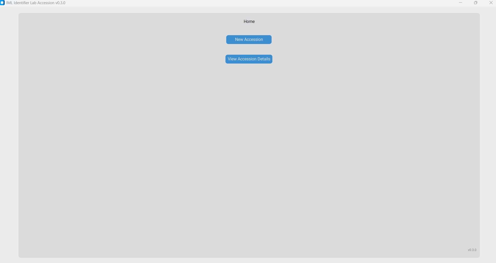
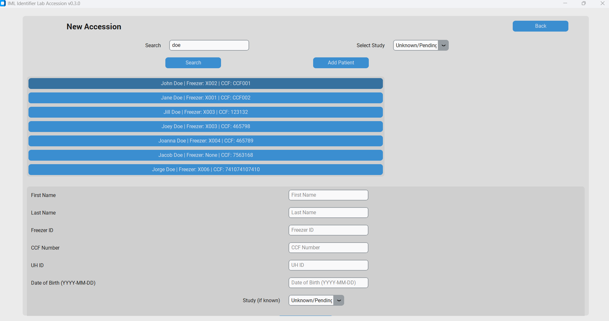
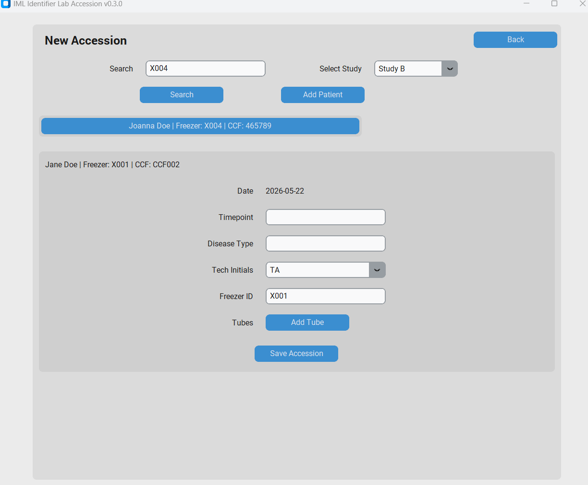
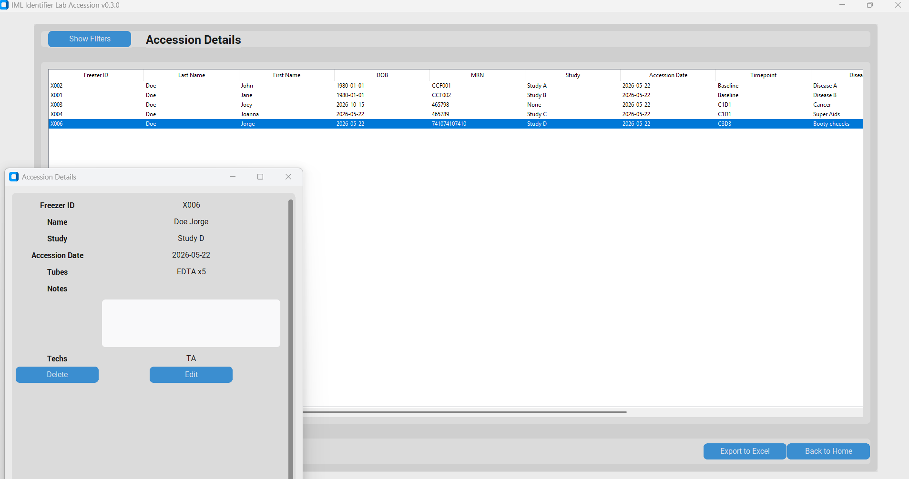

# Lab Accession App

This is a desktop application for logging and managing clinical research lab samples accessions. 

---

## Project Reasoning
Clinical research labs often track sample accessions in shared Excel files, which causes file locking conflicts when multiple techs access it simultaneously. This tool replaces that workflow with a normalized SQLite database and a clean desktop UI, enabling reliable concurrent access, structured data entry, and fast lookup across years of accession records.

---

## Installation and Setup

### Requirements
- Python 3.11+

### Installation

Clone the repository:
```bash
git clone https://github.com/boyeshenry-byte/lab-accession-app.git
cd lab-accession-app
```

Create and activate a virtual environment:
```bash
python -m venv venv
```
```bash
# Windows
venv\Scripts\activate
# Mac/Linux
source venv/bin/activate
```

Install dependencies:
```bash
pip install -r requirements.txt
```

Create a `.env` file in the project root:
```
DB_PATH=C:\path\to\your\database\lab_accession.db
```

Run the app:
```bash
python main.py
```

---

## Features
- New accession entry with patient search and creation.
- Auto-population of study and freezer ID for existing patients.
- View all accessions page with filterable table.
- Click-to-expand detail popup.
- Edit accessions including post-processing details.
- Soft delete with confirmation.
- Export to Excel.
- Shared SQLite database for multi-user access.

---

## Tech Stack
- Python 3.11+
- CustomTkinter - desktop UI
- SQLite - shared database
- openpyxl - Excel export

---

## Usage

To log a new accession, click the New Accession button on the home page. Type the name, unique patient identifier or unique freezer ID in the search bar to look for existing patients. If one exists, click on them and fill out the new accession information. If not, click add patient and fill out the patient information followed by the new accession information and save. New studies and new tech initials can be added by clicking on their respective dropdowns. To view or edit existing accessions, click view from the home page. Click filter to search or filter as needed. Click on the corresponding accession to view the popout details. Accessions can be edited or deleted from here. Filtered results can be exported to Excel by clicking the export button on the view page. 









##  Author

**Henry Boyes**
- GitHub: [@boyeshenry-byte](https://github.com/boyeshenry-byte)
- LinkedIn: [Henry Boyes](https://linkedin.com/in/hboyes)
- Email: boyeshenry@gmail.com

---

##  License

This project is licensed under the MIT License - see the [LICENSE](LICENSE) file for details.
